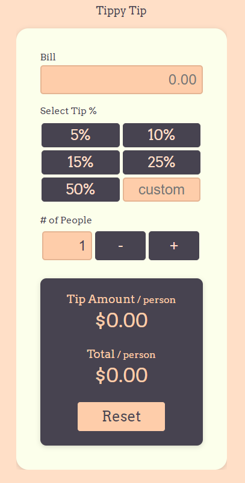

# Tippy Tip - v2 - React App

## Overview
Tippy Tip v2 is a tip calculator and bill splitter, built mobile first. Built with React

### The challenge

Users should be able to:

- View the optimal layout for the app depending on their device's screen size
- See hover states for all interactive elements on the page
- Calculate the correct tip and total cost of the bill per person

### Screenshot

### Links
- Live Site URL: [Tippy Tip V1](https://jasondormier.github.io/tippy-tip-v1/)

## My process

- Establish the goals and user stories
- Wirebox the JSX elements
- Style JSX to style guide
- Setup state and props
- Add finish functionality from with JavaScript
- Test and add further validation

### Built with

- React
- CSS custom properties
- Flexbox
- Javascript

## Author
- Jason Dormier
- Github - [GitHub](https://github.com/JasonDormier)
- LinkedIn - [LinkedIn](https://www.linkedin.com/in/jasondormier/)

# tippy-tip-v2
